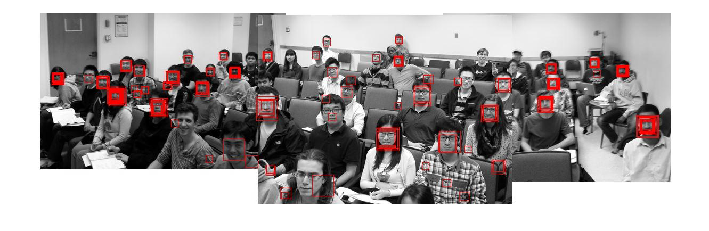

# CodeSamples
For this project, we did face detection in photos using adaBoost and realBoost. It is an individual project.

The project spec is at:
http://www.stat.ucla.edu/~sczhu/Courses/UCLA/Stat_231/Face_detection.html

This is a test photo using the model I trained:

Please refer to report.pdf for my final result.
